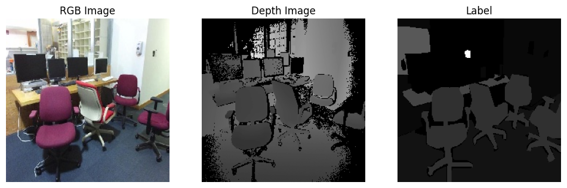

# RGB-D Segmentation
## Introduction  
This is the simple implementation to observe the SUNRGB-D dataset in the segmentation task.   
The implementation is running on the colab. If you want to implement in the local machine, please make sure change the path inside the code.  
To achieve the segmentation task, this code utilized UNet to train and compare different ways to fuse the RGB and Depth images.  


## Installation
1. To install the repository, simply download the zip file or clone the repository.  
```
git clone https://github.com/liudiepie/RGB-D_Segmentation.git
```

2. After downloading the folder, upload the ipynb file to the google colab.  
3. In the google colab, upload the sun_resize.zip in the repository.  
4. Then, follow the instruction in the ipynb file and execute the blocks.  
5. Enjoy the simple way to observe the RGB-D Segmentation  

## UNet Architecture
To compare different fusions with RGB-D dataset, this repository implements three methods to construct the models.  
1. RGB Only  

2. Merge RGB and Depth images at the beginning of the model  

3. Merge RGB and Depth images at the middle of the model  


## Result
After 50 epochs, the result showed that the RGB-D models increased 4% of accuracy compared with RGB-Only model.  
This indicated the potential of the RGB-D model applications in various fields.  
Here are the outputs from the models:  
1. RGB Only  

2. Merge RGB and Depth images at the beginning of the model  

3. Merge RGB and Depth images at the middle of the model  

